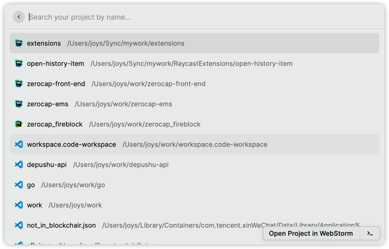
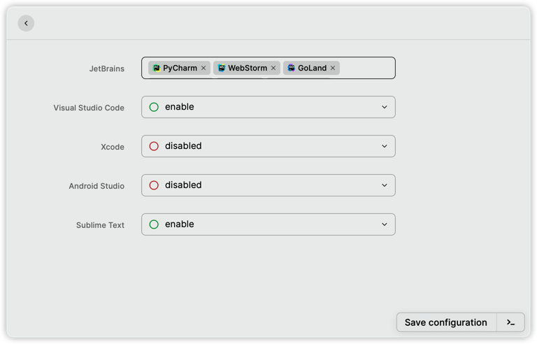

# open-history-item

[Raycast](https://www.raycast.com/) extensions for [open-history-item](https://github.com/JoysKang/open-history-item).

## 支持IDE和编辑器

- JetBrains:
  - [x] Android Studio
  - [x] AppCode
  - [x] CLion
  - [x] DataGrip
  - [x] GoLand
  - [x] IntelliJ IDEA
  - [x] PhpStorm
  - [x] PyCharm
  - [x] Rider
  - [x] RubyMine
  - [x] WebStorm
- Sublime Text:
- Visual Studio Code:
- Xcode:

## 支持的系统
仅支持 macOS

## 食用
安装插件后，直接使用 **history** 命令，唤出历史项目列表，选择项目打开即可。效果如下图

使用 **configure** 命令，可以设置默认打开的项目，如果没有设置，则默认开启全部。

## LICENSE

[MIT](./LICENSE)